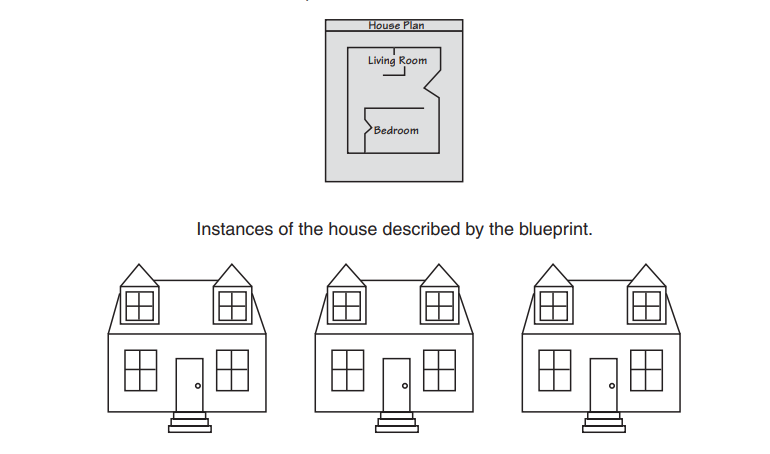

# Aula 2 - Programação Orientada a Objetos
**Conteúdo**

Conceitos básicos de classes e métodos em C++ (C plus-plus)

**Roteiro**

1. Fazer a leitura da comparação entre Programação Procedural e Programação Orientada a Objetos
2. Executar o exemplo em C++ que define um objeto Retângulo
3. Descrever quais são os objetos, classes, atributos e funções membros do exemplo.

**1. Programação Procedural e Programação Orientada a Objetos**

> Programação Procedural consiste em um métotodo de programação que envolve escrever software centrado nos procedimentos ou ações que o programa executa. Programação Orientada a Objetos (POO) envolve escrever software centrado em **objetos**. Objetos são criados a partir de **tipos de dados abstratos** que **encapsulam** **dados (atributos)** e **procedimentos (funções)** juntos. POO envolve a definição de um objeto *self-contained* i.e., uma unidade consistindo de atributos (dados) e métodos (funções) além de inúmeros conceitos tais como, **encapsulamento** e **information  (data) hidden**

**Objetos**
> Um objeto é uma entidade de software que contém ambos - dados e procedimentos. 

**Atributos**
> Dados contidos dentro de um objeto

**Procedimentos**
> Funções contidas dentro de um objeto. Também conhecidas como funções membros ou métodos.

**Exemplos**
1. Automóvel
2. Celular
3. Datashow
4. Impressora
5. Professor
6. Secretária

**Questão 1 - Forneceça pelo menos 5 exemplos de objetos do mundo real**
**Questão 2 - Quais vanagens de se ter um veículo (objeto), como por exemplo, um automóvel para uma pessoa**

**Classes**
Antes de criar um objeto o programador deve criar uma classe que se assemelha a uma planta (*blueprint*) com os atributos e métodos de um objeto particular.

**Classes**
> Uma classe consiste em atributos e métodos (funções) que irão descrever um objeto. Pense em uma classe como uma metáfora para uma "planta de uma casa".

**Questão 3 - Suponha que você quer iniciar um negócio na área de TI e quer criar uma empresa nessa área. Nesse caso, a sua empresa seria uma pequena *startup* - mas com grandes possibilidades de negócios. Além dessa startup, você também gerencia uma empresa de grande porte do segmento de alimentos. Nesses dois cenários, qual ou quais classes você você criaria ? Quail ou quais seriam os objetos (instancias) que você criaria ?**

**2. Executar o exemplo em C++ que define um objeto Retângulo**

Agora que você compreendeu os conceitos básicos de POO tente compilar e executar o exemplo em C++ abaixo disponível no livro de referência [[1]] página 711.

- [Exemplo Retângulo][3]

**3.  Descrever quais são os objetos, classes, atributos e funções membros do exemplo.**

**Referência**
- [C++: From Control Structures Through Objects" by Tony Gaddis][1] 
- [Exemplos][2]

[1]:https://www.syl9.com/csci193/Notes/193eigth.pdf
[2]:https://github.com/jesushilarioh/DelMarCSi.cpp
[3]:../SourceCode/Chapter%2013/Pr13-1.cpp
