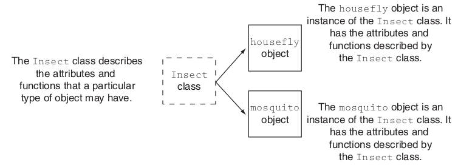
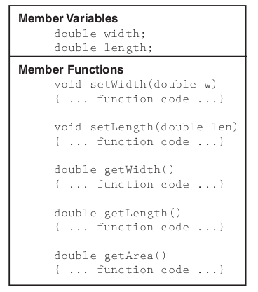
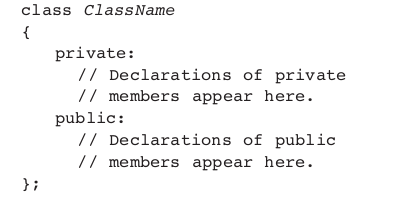

# Aula 3 - Programação Orientada a Objetos
**Conteúdo**

Prática com classes, objetos em C++ (C plus-plus)

**Roteiro**

- Fazer a leitura do texto de introdução
- Baixe o código C++ que define um objeto Retângulo
- Descrever quais são os objetos, classes, atributos e funções membros do exemplo.

**PASSO 1. Estrutura de um programa orientado a objetos**

> Um programa orientado a objetos é construído com base em um modelo do tipo **classe**. 

A Figura abaixo ilustra o conceito de classe e instânciação i.e., a criação de objetos (geração) a partir de sua classe (tipo) 

 

**PASSO 2. Estrutura de um programa orientado a objetos**

> O **encapsulamento** corresponde ao agrupamento dentro de uma **classe** dos respectivos dados (width e length) e suas funções que operam sobre esses dados.

A Figura abaixo ilustra o conceito de encapsulamento via a definição de uma classe em C++ 

Em C++ existe uma estrutura formal que deve ser seguida para a definição de uma classe com seus membros. Nesse caso, implicando em *information hidden* através do encapsulamento que ocorre com o uso de modificadores de acesso *public* e *private*. Veja o exemplo abaixo.

 

**Questão 1 - Considerando que um retângulo poderia ser descrito também com sua profundidade (i.e., em 3D) que membros a mais deveriam ser criados**

**PASSO 3. Executar o exemplo em C++ que define um objeto Retângulo**

Agora que você compreendeu os conceitos básicos de POO tente compilar e executar o exemplo em C++ abaixo disponível no livro de referência [[1]] página 711.

Para isso, faça:
1. Baixe o exemplo [Exemplo Retângulo][3] em seu ambiente de desenvolvimento local
2. Salve o arquivo com a extensão .cpp (vem C++)
3. Compile com **g++** (não use o gcc pois é um código em C++). Se usar outro IDE ou Editor gráfico o processo é o mesmo para aplicação em C. Compile via terminal
4. Modifique o código para aceitar um novo valor de profundidade para o retângulo. Considerar também as funções membros de acesso ao atributo.

**Referência**
- [C++: From Control Structures Through Objects" by Tony Gaddis][1] 
- [Exemplos][2]

[1]:https://www.syl9.com/csci193/Notes/193eigth.pdf
[2]:https://github.com/jesushilarioh/DelMarCSi.cpp
[3]:../SourceCode/Chapter%2013/Pr13-1.cpp
