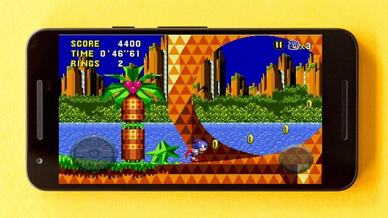
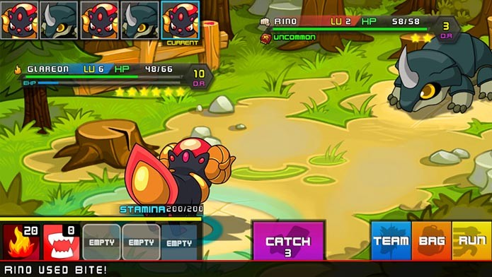
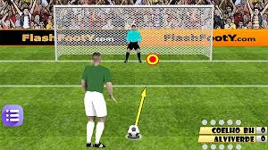

# Aula 4 - Programação Orientada a Objetos
**Conteúdo**

Revisão sobre classes, objetos em C++ (C plus-plus)

**Roteiro**

- Construir por meio de uma dinâmica (em duplas) um classe em C++
- Usar como requisitos básicos a) Tem que ser um objeto de um Jogo; e b) Ter atributos e métodos que um jogador (gamer) poderá usar desse objetivo

**PASSO 1. Metáfora de um Jogo**

> Um Jogo (2D ou 3D) em geral, utiliza diferentes tipos elementos gráficos, objetos, cenários e linhas de renderização. Nesse contexto, o uso de POO é muito útil - sobretudo considerando-se o comportamento que os objetos podem exercer em um cenário real**. 

As Figuras abaixos ilustram diferentes tipos de cenários de jogos

**JOGO 1**

 

**JOGO 2**

 

**JOGO 3**

 

**JOGO 4**

 

**PASSO 2. Escolha de um Jogo*

- Escolha um jogo (diferente de uma outra dupla)
- Crie ao menos dois objetos - com atributos e métodos - para esse jogo
- Crie um arquivo principal - main.cpp - para testar seu código
- Use de exemplo o código disponível em [[3]]

**Referência**
- [C++: From Control Structures Through Objects" by Tony Gaddis][1] 
- [Exemplos][2]

[1]:https://www.syl9.com/csci193/Notes/193eigth.pdf
[2]:https://github.com/jesushilarioh/DelMarCSi.cpp
[3]:../SourceCode/Chapter%2013/Pr13-1.cpp
