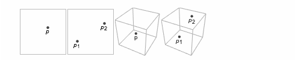
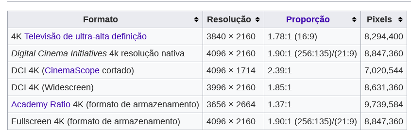

# Aula 5 - Programação Orientada a Objetos
**Conteúdo**

Prática em C++

**Roteiro**

- Construir em C++ duas classes - Ponto2D e Ponto3D
- Definir as propriedades pertinentes
- Criar instancias (exemplos) de ambos
- Compreender o conceito de passagem de parâmetro via invocação (chamada) de método

**PASSO 1. Metáfora Ponto Abstrato**

> Conceitualmente um ponto é uma representação - abstrata - das coordenadas X e Y em um espaço euclidiano de duas dimensões. Também pode ser definido em termos de um espaço euclidiano de dimensões-N

A Figura abaixo ilustra o conceito de ponto para o tratamento gráfico através da ferramenta Mathematica [[4]]

**Definição de Ponto**

 

**PASSO 2. Atividade**

- Com base no exemplo [[3]] crie uma classe Ponto 2D 
- Crie os atributos necessários (coordenadas X e Y)
- Crie dois pontos com as seguintes coordenadas. Na origem, i.e. com sendo (0,0). Um ponto representando o máximo, i.e., com (100,100).

**ATIVIDADE - DESAFIO MONITORES 4K**

Considere um monitor de ultra definição (4K). Tais monitores são conuns atualmente no mercado por possuirem a capacidade de representar pontos (mais conhecidos como Pixels) acima de 3840 pixels na horizontal e 2160 na vertical. Portanto, é importante compreender as principais características desses monitores. Nesse caso, suponha que você irá desenvolver um sistema de Gestão e Controle para uma empresa de venda via Internet de Monitores. A empresa deseja portanto representar os monitores de alta definição da melhor forma possível para auxiliar na busca e recuperação de informação para potenciais clientes. Veja o exemplo abaixo,

 

Com base nesse exemplo (_case_) faça uma classe que represente um Monitor com os seguintes atributos - Coordenadas máximas (resolução), Descrição e Número de Pixels. Faça com que o carregamento dos dados seja feita de duas formas. Na primeira delas crie uma classe MonitorTeste.cpp para carregar e validar a solução proposta. Em seguida, crie uma outra classe para fazer o carregamento dos monitores via teclado.

**DATA DA ENTREGA - 10/04/2019 - INDIVIDUAL -- ENTREGAR VIA GIT**

**Referência**
- [C++: From Control Structures Through Objects" by Tony Gaddis][1] 
- [Exemplos][2]

[1]:https://www.syl9.com/csci193/Notes/193eigth.pdf
[2]:https://github.com/jesushilarioh/DelMarCSi.cpp
[3]:../SourceCode/Chapter%2013/Pr13-1.cpp
[4]:https://reference.wolfram.com/language/ref/Point.html?q=Point
[5]:https://pt.wikipedia.org/wiki/Resolu%C3%A7%C3%A3o_4K
