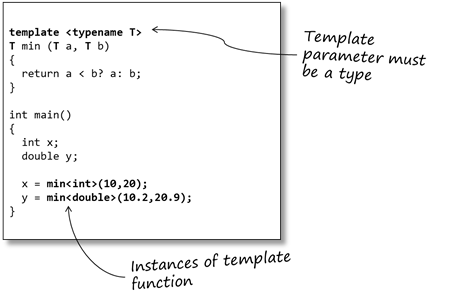

# Aula 6 - Programação Orientada a Objetos
**Conteúdo**

Prática em C++

**Roteiro**

- Compreender conceitos de POO através da biblioteca STL (Standard Template Library)
- Usar uma biblioteca real de games em STL para manipulação de menus

**PASSO 1. Biblioteca STL**

> A Standard Template Library (STL) é um conjunto de classes-template em C++ que fornecem estruturas de dados e funções como listas, pilhas, vetores e etc. A biblioteca STL possui quatro componentes principais - Algoritmos; Containers; Funções e Iteradores. 

A base do funcionamento da STL é o mecanismo de _templates_ em C++. Nesse caso, a Figura abaixo ilustra uma abstração geral do conceito de _templates_ [[1]]

 


Um _template_ em C++ pode ser visto como uma variável que pode ser instanciada para qualquer tipo de dado, mesmo que este seja um tipo de dado da linguagem ou um tipo de dado definido pelo usuário. O funcionamento do _template_ é aplicado seja para funções (rotinas) ou classes. Sendo portanto chamdas de _template function_ ou _template class_

```
#include <iostream> 
using namespace std; 

// Uma função que funciona para qualquer tipo de dado. Ela deve funcionar até mesmo para os tipos definidos pelo usuário. 

template <typename T> 
T mim(T x, T y) 
{ 
return (x < y)? x: y; 
} 

int main() 
{ 
cout << mim<int>(3, 7) << endl; // chama a rotina mim() para valores inteiros
cout << mim<double>(3.0, 7.0) << endl; // chama a rotina mim() para valores double
cout << mim<char>('g', 'e') << endl; // chama a rotina mim() para char

return 0; 
}
```


**Exemplo de STL com vector**

Vetores são estruturas de arrays (vetores) com a capacidade de redimensionamento automaticamente quando um elemento é adicionado ou removido da estrutura com o seu tamanho sendo reorganizado de forma automática. Vetores (_Vectors_) são declarados em espaços continuos de memórias visando o seu acesso sequencial usando iteradores. Em vetores, os dados são inseridos no final da estrutura de dados. Adicionar um elemento no final, requer um tempo de acesso (escrita) relativo ao tempo de percorrer e redimensionar a memória para N+1 itens. Remover o último elemento requer um tempo de acesso constante uma vez que nenhum espaço de memória é redimensionado. Remover no meio ou no início requer um tempo de acesso linear [[2]].

```
#include <iostream> 
#include <vector> 

using namespace std; 

int main() 
{ 
    vector<int> g1; 

    for (int i = 1; i <= 5; i++) 
        g1.push_back(i); 

    cout << "Size : " << g1.size(); 
    cout << "\nCapacity : " << g1.capacity(); 
    cout << "\nMax_Size : " << g1.max_size(); 

    // redimensiona o vetor para tamanho 4 
    g1.resize(4); 

    // imprime o tamanho do vetor após o resize() 
    cout << "\nSize : " << g1.size(); 

    // verifica se o vetor não está vazio
    if (g1.empty() == false) 
        cout << "\nVector is not empty"; 
    else
        cout << "\nVector is empty"; 

    // Shrinks the vector 
    g1.shrink_to_fit(); 
    cout << "\nVector elements are: "; 
    for (auto it = g1.begin(); it != g1.end(); it++) 
        cout << *it << " "; 

    return 0; 
} 
```


**PASSO 2. MenuTemplates**

Nesse passo, é importante que o aluno compreenda os conceitos de POO relacionadas com uma biblioteca de propósito geral em C++ para games. 

Para isso, usaremos a biblioteca [MenuTemplate][3] que usa vários conceitos de POO que aprendemos até agora. 

Acesse o link do projeto em [GitHub][3] e baixe o projeto localmente. Faça compilação local do projeto e verifique se algum erro é reportado.

Para isso use o comando abaixo

```
g++ main.cpp MenuTemplate/MenuTemplate.cpp MenuTemplate/Entry.cpp MenuTemplate/ExternFunctions/getChar.cpp -o MenuTemplate
```


Após a compilação será apresentado um erro em linha de comando

```
MenuTemplate/ExternFunctions/getChar.cpp:18:19: fatal error: conio.h: No such file or directory
 #include <conio.h>
                   ^
compilation terminated.
```

A partir desse erro, você consegue corrigir o código ? Sabe indicar qual o causa relacionada com esse erro de compilação ?

_Dica. Tente corrigir o código adicionando a directiva de compilador #define LINUX_

**Referência**
- [The C++ Standard Template Library (STL)][1] 
- [Vector][2]
- [MenuTemplate][3]

[1]:https://www.geeksforgeeks.org/vector-in-cpp-stl/
[2]:https://www.geeksforgeeks.org/the-c-standard-template-library-stl/
[3]:https://github.com/Hasenfresser/MenuTemplate

