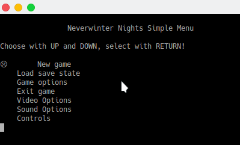
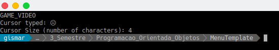

### Faculdade: Asser (Rio Claro - SP) - Curso: Sistemas da Informação - Disciplina: POO (3º Período)

Aluno: Gismar Barbosa - POO Prova 1 - Link para respositório: *<https://github.com/gismarb/MenuTemplate>*

------

##### *Respostas:*

1. A solução encontrada para resolver a demanda levantada pela questão 1, foi apenas adcionar mais entradas *"`addEntry`"*, conforme as entradas solicitadas (*`Video Options; Sound Options; Controls`*) no código do arquivo *"`main.cpp`"*. Segue código usado abaixo:

   ```c++
   // Prova P1 (1) - Adicionando (Video Options, Sound Options, Controls)
       MenuA.addEntry("GAME_VIDEO", "Video Options");
       MenuA.addEntry("GAME_SOUND", "Sound Options");
       MenuA.addEntry("GAME_CONTROLS", "Controls");
   ```

2. Para modificar a descrição, apenas alterei  o Atributo *"`Title`"* em *"`MenuA`"* no código do arquivo *"`main.cpp`"* , conforme código abaixo:

   ```c++
   // Prova P1 (2) - Adicionando novo titulo (Neverwinter Nights Simple Menu)
       MenuA.Title = "\n\t\tNeverwinter Nights Simple Menu";
   ```

   

3. Para a cricação da rotina *"`getCursor()`"*, e assim sendo, ser possível exibí-la junto a saída da opção desejada do menu, foram necessárias alterações em 2 arquivos (*`main.cpp; MenuTemplate/Menutemplate.cpp`)*, conforme desmonstra abaixo:

   `main.cpp`

   ```c++
       // Prova P1 (3) - Fazendo uso metodo getCursor (mostrando qual foi o cursor utilizado)
       cout << "Cursor typed: " << MenuA.getCursor() << endl;
   ```

   `MenuTemplate/MenuTemplate.cpp`

   ```c++
   // Prova P1 (3) - Adicionando metodo getCursor (para que possa ser usada no main.cpp)
   // Este metodo esta declarado na em MenuTemplate/MenuTemplate.hpp (linha 365)
   string MenuTemplate::getCursor() {
       return this->Cursor;
   }
   ```

   

4. Para contar a quantidade de caracteres que o Cursor possuía, foram necessárias modificações nos 3 arquivos (*`main.cpp; MenuTemplate/MenuTemplate.hpp; MenuTemplate/Menutemplate.cpp`), visando a implementação desta nova funcionalidade, conforme mostra os códigos abaixo:

   `main.cpp`

   ```c++
    // Prova P1 (4) - Fazendo uso do metodo setCursorSize (definindo o tamanho da string em funcao de getCursor)
       MenuA.setCursorSize(MenuA.getCursor().length());
       
       // Prova P1 (4) - Fazendo uso do metodo getCursorSize (mostrando tamanho da string)
       cout << "Cursor Size (number of characters): " << MenuA.getCursorSize() << endl;
   ```

   `MenuTemplate/MenuTemplate.hpp`

   ```c++
   	// Prova P1 (4) - Definindo atributo CursorSize (tipo int, pois armazenará o tamanho da string)
   	int CursorSize;
   
   	// Prova P1 (4) - Definindo metodo (setCursorSize)
   	void setCursorSize(const int CursorSize);
   	
   	// Prova P1 (4) - Definindo metodo (getCursorSize)
   	int getCursorSize();
   ```

   `MenuTemplate/MenuTemplate.cpp`

   ```c++
       // Prova P1 (4) - Implementando metodos CursorSize (setCursorSize e getCursorSize)
       void MenuTemplate::setCursorSize(const int CursorSize) {
           this->CursorSize = CursorSize;
       }
   
       int MenuTemplate::getCursorSize() {
           return this->CursorSize;
       }
   ```

   

5. A questão 5 me deixou com algumas dúvidas, e pode ser que a solução encontrada, não seja a ideal, ou a solicitada. Procurei criar novas funcionalidades, ou até mesmso, modificas as já existentes de forma que não oi código não perdesse suas características. Desta forma, acabei por modificar o método *"`setCursor`"*, ao incvés de criar outro. *Pensei que seria errado dois métodos set, com a mesma descrição, mas depois eu, pesquisando na Internet, verificando que é possível utilizar sobrecarga de funções/métodos (quando eu mudo algum tipo de detalhe nos parâmetros ou retorno dos mesmos)*. Mas, achei melhor manter minha solução, pois já havia caminhado na mesma *(e tomado um bom tempo para implementá-la)*.

   Desta forma,  o que eu fiz foi, conforme manda o enunciado, modificando o método *"`setCursor`"* *(presentes nos arquivo `MenuTemplate/Menutemplate.hpp` e `MenuTemplate/MenuTemplate.cpp`)*, para que o mesmo passasse a receber mais um parâmetro, ficando  *"`setCursor(const string &Cursor, const bool isUnicode)`"*, dentro do mesmo mudando a lógica de validação. Neste ponto, no arquivo *"`main.cpp`"*, eu incluir a passagem do parâmetro adionado em *"`MenuA.setCursor`"*, passando ao invés passar apenas uma *"`string`"*, eu adcionei um parâmetro booleano, ou seja, *"`true`"* ou *"`false`"*.

   E para todo os esuema funcionar, nos arquivos *"`MenuTemplate/MenuTemplate.hpp`"* e *"`MenuTemplate/MenuTemplate.cpp`"* eu criei *novos atributos e métodos para forçar as validações, e garatir o tipo de string que estava sendo passada ao objeto*. Sendo assim, foi criado o atributo *"`TypeCursor`"* *(tipo booleano)* e, os métodos *"`setValidHexCursor`"* e *"`getValidHexCursor`"*, visando apenas validar que o tipo de string de entrada *seria ou não um hexadecimal*. Uma vez que isso fois provado ou não, o método *"`setCursor`"*, junto com as demais condicionais implentadas, garatiria que tudo funcionasse como planejado *(que retornasse uma string ASCII ou Unicode UTF-8, conforme parâmetro repassado)*. Abaixo, segue códigos mudados/implementado nos 3 arquivos já citados acima:

   `main.cpp`

   ```c++
   // Prova P1 (5) - Alterando usando o metodo setCursor(para validar se é isUnicode)
       MenuA.setCursor("\xe2\x98\xb9	", true);
       // Abaixo exemplos de entradas testadas
       //MenuA.setCursor("\xe2\x99\x90	", false);
       //MenuA.setCursor("> ", false);
       //MenuA.setCursor(" ", false);
       //MenuA.setCursor(">--> ", true);
   ```

   `MenuTemplate/MenuTemplate.hpp`

   ```c++
   // Prova P1 (5) - Criando atributo TypeCursor (para validar entradas hexadecimais)
       bool TypeCursor;
       
   // Prova P1 (5) - Criando metodo setValidHexCursor (para validar entradas hexadecimais)
       void setValidHexCursor(const string &Cursor);
   
   // Prova P1 (5) - Criando metodo getValidHexCursor (para recuperar o retorno da validacao)
       bool getValidHexCursor();
   
       // Prova P1 (5) - Alterando declaracao do metodo setCursor(para receber isUnicode)
       void setCursor(const string &Cursor, const bool isUnicode);
   
   ```

   `MenuTemplate/MenuTemplate.cpp`

   ```c++
   // Prova P1 (5) - Alterando declaracao do metodo setCursor(para receber isUnicode)
   void MenuTemplate::setValidHexCursor(const string &Cursor) {
      	if((Cursor[0] == '\xe2') && ((Cursor[1] == '\x98') || (Cursor[1] == '\x99'))) 
       	TypeCursor = true;
       else
          	TypeCursor = false;
   }
   
   // Prova P1 (5) - Criando metodo getValidHexCursor (para recuperar o retorno da 	validacao)
   bool MenuTemplate::getValidHexCursor() {
    	//return this
       return this->TypeCursor;
   }
   
   // Prova P1 (5) - Testando para saber se é Unicode
   // Usando Metodo setValidHexCursor (criado para checar a entrada do hexadecimal)
   MenuTemplate::setValidHexCursor(Cursor);
   
   // Usando o metodo getValidHexCursor, implementamos e verificamos os restornos, visando tratar excecoes
   if((isUnicode) && (MenuTemplate::getValidHexCursor()))
       this->Cursor = Cursor;
   
   if((isUnicode) && (!MenuTemplate::getValidHexCursor()))
     	throw string ("Option to hexadecimal set, but is not hexadecimal");
   
   if((!isUnicode) && (MenuTemplate::getValidHexCursor()))
     	throw string ("Option to hexadecimal not set, but is hexadecimal");
           
   this->Cursor = Cursor;
   
   // Testing, if new Cursor equals old Cursor. If true: return.
    	if(this->Cursor == Cursor)
         	return;
   }
      
   ```

   

6. Não fiz, pois não consegui entender como funcionam as funcionalidades das ferramentas da *STL*. eu vi que estmos definindo *"`vector <Entry> Entries`"*, e assim tornando *"`Entries`"* um estrutura de dados tipo *FILA (FIFO)*, mas não consegui manipular a mesma para que o final sempre voltasse para o ínicio. Na verdade pensei em trocar de *"`vector`"* para *"`array`"*, *"`queue`"* ou até mesmo *"`list`"* presente no *STL*, mas não tive tempo para administrar o conhecimentos *(estudar e entender, para aplicar no código sem mudar as caracteríticas/estilo do código, ou seja, não consegui implementar sem retirar todo o código, e criar um código geral novo, o que eu acredito que não é o foco da questão)*.

#### Imagens do Programa, após as modificações:







